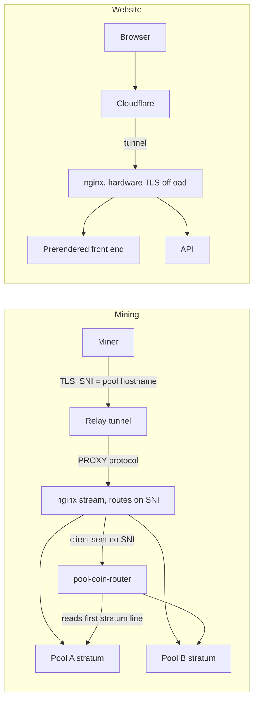

# Pwnda architecture

How [pwnda.org](https://pwnda.org) is put together: a self-hosted mining pool operation and a
companion non-custodial wallet, run by one person on one box. This page describes the design at
the level a reader needs to understand the tradeoffs. It names no internal hosts or ports, and
no figure that pwnda.org does not already publish.

## Two ingress paths

Miners and website visitors arrive over two entirely separate paths that happen to terminate on
the same machine.

**Mining.** Each pool has its own public stratum hostname, and miners connect over TLS with that
hostname as the SNI value. One relay tunnel carries all of them from the public internet to the
box, using wildcard subdomains so that adding a pool never means adding a tunnel. The relay
forwards a PROXY protocol header, so the box still sees each miner's real address after the hop.
nginx terminates TLS and selects the pool from the SNI value alone, before a single stratum byte
is read.

Some mining software does not send SNI at all. Instead of dropping those connections, they fall
through to `services/cmd/pool-coin-router`, which reads the first line of the stratum handshake - it
always carries an address or worker name - and forwards to the matching pool.

**Website.** Browsers reach the site through Cloudflare, which tunnels to the box without
exposing its address. nginx terminates TLS again here, offloading the handshake asymmetric
crypto to a dedicated accelerator card so it does not compete with mining traffic for CPU. What
it serves is a prerendered React build rather than a live server-rendered app, so every page
exists as static HTML the moment a crawler or a slow client asks for it.

## Why each piece exists

**One relay tunnel for several pools.** A tunnel per pool would mean another moving part, another
failure domain, and another credential to rotate every time a coin is added. Wildcard SNI routing
collapses that into one tunnel plus one nginx map, so a fourth coin is a config change rather than
new infrastructure.

**The SNI-less router.** SNI is the primary routing signal, but it is opt-in client-side and some
widely used miners omit it. Misrouting such a miner to whichever pool happens to be the default
produces a connection that looks fine and never receives valid work - an invisible failure. A
small stateless router that peeks at one protocol line turns that into correct behaviour without
asking anyone to reconfigure their rig.

**Hardware TLS offload, and its pitfall.** One box running several full nodes, a website, and many
concurrent TLS-terminated miner sessions is contended from every direction, so moving handshake
crypto onto a dedicated card is real headroom. The pitfall worth recording: the in-tree kernel
driver for that hardware wants the IOMMU enabled, which conflicts with a boot-time decision made
for unrelated reasons, so the deployment stays on the out-of-tree driver. That is written down
precisely so a future rebuild does not helpfully flip a kernel flag and silently lose TLS offload.

**Per-coin process isolation.** Each coin runs its own node, wallet and pool processes under its
own service group rather than one shared daemon, so one coin's node failing cannot take the other
pools down. Each group is watchdogged independently, and boot is gated behind a short delay so a
crash-reboot leaves a human a window to intervene instead of entering an unattended restart loop.

**Certificate automation.** Certificates renew on a timer with no manual step. This matters more
for mining than for the website: an expired certificate on a web endpoint produces a loud browser
warning, while on a stratum endpoint miners simply stop connecting.

**Live-fund isolation.** Every wallet holding real funds binds to loopback only and is unreachable
from outside the machine; those that need it sit behind their own authentication rather than
trusting network position. Nothing off-box can reach a wallet under any circumstance - only the
pool's own payout process, on the same machine, ever talks to one.

## Payout flow, at design level

Submitted shares are recorded and scored against a rolling window rather than paid per share, so
payout weight tracks sustained contribution instead of rewarding someone who arrives just in time
for a lucky block. When a block is found its reward is attributed across that window and credited
to each miner's pending balance. A scheduled process periodically settles balances that have
cleared a minimum threshold, converting into the miner's chosen payout coin where that differs
from the coin they mined.

The settlement path - the exchange integrations and the swap orchestration behind those nineteen
payout coins - is not published. Design-level detail and a walkthrough are available on request.

## Incident: logs that were not rotating, for three and a half months

The box's custom nginx build lives under `/usr/local`, and a logrotate policy for it had been
installed and was believed to be working. It had never rotated once. The error log had reached
2.1 GB and the access log 1.5 GB as single files.

The cause was a sandboxing directive, not a bad config. `logrotate.service` ships with
`ProtectSystem=full`, which mounts `/usr` read-only for that unit. So logrotate ran every day,
tried to rename a file under `/usr/local`, failed with a read-only filesystem error, and exited -
every day, for months. The fix was a service drop-in granting that one path write access.

Two things made it invisible for so long. First, `/var/log` rotated perfectly normally, because
nothing there is under `/usr`, so the obvious spot check - looking for recent `.gz` files - came
back healthy. Second, a logrotate config file existing had been taken as evidence that logrotate
was doing something with it.

The lesson kept from this one: a configuration existing is not evidence that it runs. The check
that would have caught it on day one was reading the unit's own journal rather than inspecting the
config, and that check is now part of how any timer-driven maintenance on this box gets verified.
